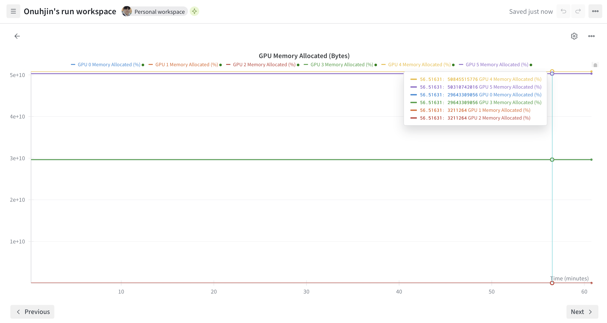
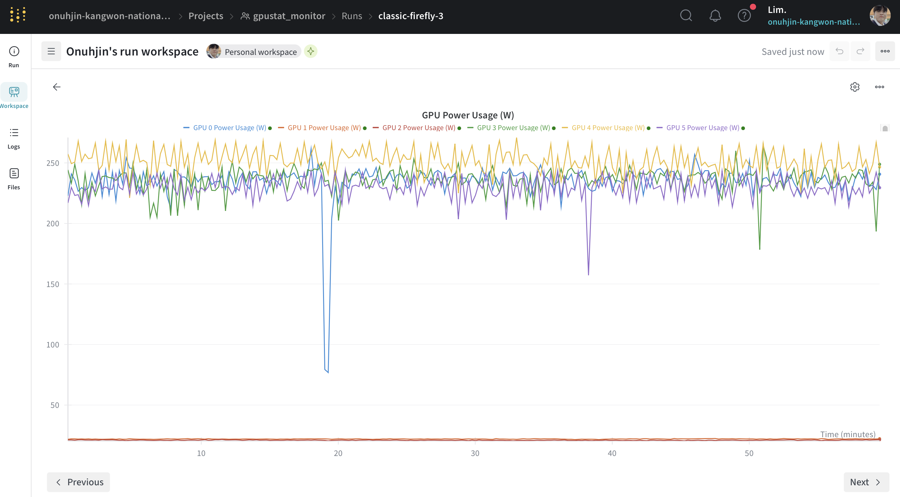
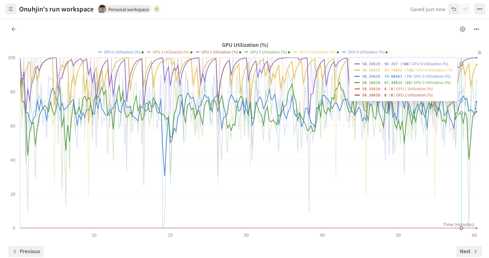

# 🚦 GPUsaver

A lightweight tool for monitoring and visualizing GPU status — especially useful for shared server environments.

## 🖼️ Example Visualizations

<p align="center">
  
  <br/><em>GPU Memory Usage</em>
</p>

<p align="center">
  
  <br/><em>GPU Power Consumption</em>
</p>

<p align="center">
  
  <br/><em>GPU Utilization</em>
</p>


## 💿 Installation

1.  **Clone the repository.**
```bash
git clone https://github.com/your-username/GPUsaver.git
cd GPUsaver
```


2.  **Create and activate the Conda environment.**
```bash
conda create -n GPUsaver python=3.11 -y
conda activate GPUsaver
```

3. **Install required packages**
```bash
pip install -r requirements.txt
```


## 🚀 Usage

```bash
script/get_statue.sh # GPU 상태 로깅 시작 (e.g., ./script/get_statue.sh --machine-name A6000)
script/run_guardian.sh # GPU 상태 변경 알림 시작 (e.g., ./script/run_guardian.sh --machine-name A6000)
script/run_visualize.sh # GPU 상태 시각화 (e.g., ./script/run_visualize.sh --logfile logs/log_gpustat_A6000.jsonl)
```

### ⚠️ Make sure you are logged into Weights & Biases if you want to use visualization:
```bash
wandb login
```

### 📁 Directory Structure

```
GPUsaver/
├── script/
│   ├── get_status.sh
│   └── run_visualize.sh
├── requirements.txt
└── README.md
```